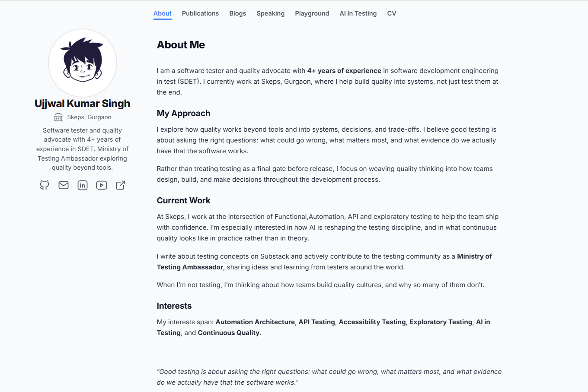

# 🐞 Being Human Tester



## 🌐 Website

**[beinghumantester.com](https://beinghumantester.com)**

This is the personal portfolio of **Ujjwal Kumar Singh**, a software tester focused on software testing, automation, AI in testing, open source, and quality engineering.

The website brings together my work, projects, writing, open source contributions, speaking activities, and experiments around AI and testing.

## ✨ About

I work in software testing and quality engineering, with experience across:

- Manual Testing
- API Testing
- Automation Testing
- Selenium with Python
- PyTest
- Database Testing
- Test Strategy and Quality Engineering
- AI-assisted and AI-driven testing
- Open Source

I also enjoy exploring how testing changes as software development becomes more automated and increasingly driven by AI.

## 🎤 Speaking

The website includes my talks, webinars, meetups, masterclasses, and conference appearances covering topics around:

- Software Testing
- AI and Testing
- Agentic Engineering
- Quality Engineering
- Open Source
- Test Automation
- Developer and Tester Collaboration

## 🤖 AI Playground

The AI Playground is a space for experimenting with ideas around AI, testing, automation, and agentic systems.

It will evolve over time as new experiments and projects are added.

## 🛠️ Projects

The portfolio includes selected projects and experiments related to:

- Test Automation
- Python
- Selenium
- PyTest
- API Testing
- AI Testing
- Agentic Systems
- Developer Tools
- Open Source

## ✍️ Writing

I write about software testing, quality engineering, AI, automation, open source, and the practical problems testers face while building and testing modern software.

## 🌱 Open Source

I contribute to and participate in open source projects and communities, with a particular interest in testing and quality.

Some of my work and contributions can be explored through my GitHub profile.

## 🧰 Tech Stack

The portfolio website itself is built using:

- [Astro](https://astro.build/)
- [Tailwind CSS](https://tailwindcss.com/)
- TypeScript
- Markdown / MDX
- GitHub Actions
- GitHub Pages

The website is hosted at **beinghumantester.com** using GitHub Pages.

## 🚀 Running Locally

### Prerequisites

- Node.js >= 22.12.0
- npm

### Install dependencies

```bash
npm install
